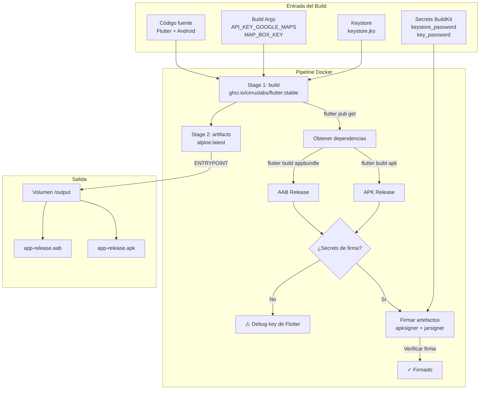

# App Condominio - Guía de Compilación con Docker

Aplicación móvil oficial desarrollada en **Flutter** para la gestión de condominios. Este proyecto incluye un `Dockerfile` multi-stage que permite compilar los artefactos Android (`APK` y `AAB`) de forma reproducible, con soporte opcional para firma segura mediante Docker BuildKit secrets.

---

## Tabla de Contenidos

1. [Diagrama del Sistema](#diagrama-del-sistema)
2. [Requisitos Previos](#requisitos-previos)
3. [Compilación Rápida](#compilación-rápida)
4. [Compilación Detallada](#compilación-detallada)
   - [Opción A: Sin firma (pruebas internas)](#opción-a-sin-firma-pruebas-internas)
   - [Opción B: Con firma local (distribución directa)](#opción-b-con-firma-local-distribución-directa)
   - [Opción C: Google Play App Signing](#opción-c-google-play-app-signing)
5. [Extracción de Artefactos](#extracción-de-artefactos)
6. [Verificación de la Firma](#verificación-de-la-firma)
7. [Notas Importantes](#notas-importantes)
8. [Solución de Problemas](#solución-de-problemas)
9. [Licencia](#licencia)

---

## Diagrama del Sistema



**Flujo resumido:**
1. El **Stage 1** compila la aplicación Flutter dentro de una imagen con el SDK completo.
2. Opcionalmente, se **firman** los artefactos usando un keystore y contraseñas inyectadas como **Docker secrets**.
3. El **Stage 2** copia únicamente los artefactos finales (`apk` y `aab`) a una imagen ligera de Alpine.
4. Al ejecutar el contenedor, un script copia los artefactos al **volumen `/output`** que montes desde tu máquina.

---

## Requisitos Previos

- [Docker](https://docs.docker.com/get-docker/) instalado (versión 20.10+ con BuildKit).
- Conocer las siguientes variables:
  - `API_KEY_GOOGLE_MAPS` y `MAP_BOX_KEY` (requeridas por la app).
  - `KEY_ALIAS`, `KEYSTORE_PASSWORD`, `KEY_PASSWORD` (requeridas solo si deseas firma segura).
- (Opcional) Tener el archivo **keystore** (`keystore.jks`) disponible si deseas firmar los artefactos.

> **Nota:** Se recomienda Docker BuildKit habilitado. Actívalo con:
> ```bash
> export DOCKER_BUILDKIT=1
> ```

---

## Compilación Rápida

### Para Google Play (App Signing)

```bash
cd app_condominio
export DOCKER_BUILDKIT=1

docker build \
  --build-arg API_KEY_GOOGLE_MAPS=TU_CLAVE_GOOGLE \
  --build-arg MAP_BOX_KEY=TU_CLAVE_MAPBOX \
  -t app_condominio:play . && \
docker run --rm -v "$(pwd)/output:/output" app_condominio:play
```

### Para distribución directa (con firma)

```bash
cd app_condominio
export DOCKER_BUILDKIT=1

docker build \
  --build-arg API_KEY_GOOGLE_MAPS=TU_CLAVE_GOOGLE \
  --build-arg MAP_BOX_KEY=TU_CLAVE_MAPBOX \
  --build-arg KEY_ALIAS=mi_alias \
  --secret id=keystore,src=keystore.jks \
  --secret id=keystore_password,src=keystore_password.txt \
  --secret id=key_password,src=key_password.txt \
  -t app_condominio:signed . && \
docker run --rm -v "$(pwd)/output:/output" app_condominio:signed
```

---

## Compilación Detallada

### Opción A: Sin firma (pruebas internas)

Usa esta opción si solo necesitas probar la aplicación en dispositivos locales o emuladores. Los artefactos se generan firmados con la **debug key de Flutter**, que no es válida para producción.

```bash
cd app_condominio
export DOCKER_BUILDKIT=1

# 1. Compilar la imagen Docker
docker build \
  --build-arg API_KEY_GOOGLE_MAPS=TU_CLAVE_GOOGLE \
  --build-arg MAP_BOX_KEY=TU_CLAVE_MAPBOX \
  -t app_condominio:build .

# 2. Extraer los artefactos
docker run --rm -v "$(pwd)/output:/output" app_condominio:build
```

**Parámetros:**
- `API_KEY_GOOGLE_MAPS`: Tu clave de API de Google Maps (requerida por `build.gradle.kts`).
- `MAP_BOX_KEY`: Tu clave de API de Mapbox (requerida por `build.gradle.kts`).

**Resultado en la carpeta `output/`:**
- `app-release.apk` (107.6 MB, firmado con debug key)
- `app-release.aab` (66.6 MB, firmado con debug key)

---

### Opción B: Con firma local (distribución directa)

Usa esta opción si necesitas distribuir el APK directamente (por email, web, etc.) y tienes tu propio keystore.

#### Paso 1: Preparar los secrets

Crea archivos temporales con las contraseñas (nunca los agregues a git):

```bash
cd app_condominio

# Crear archivos temporales con las contraseñas
echo "tu_keystore_password" > keystore_password.txt
echo "tu_key_password" > key_password.txt
```

#### Paso 2: Compilar y firmar

```bash
export DOCKER_BUILDKIT=1

# Compilar la imagen con firma
docker build \
  --build-arg API_KEY_GOOGLE_MAPS=TU_CLAVE_GOOGLE \
  --build-arg MAP_BOX_KEY=TU_CLAVE_MAPBOX \
  --build-arg KEY_ALIAS=mi_alias \
  --secret id=keystore,src=keystore.jks \
  --secret id=keystore_password,src=keystore_password.txt \
  --secret id=key_password,src=key_password.txt \
  -t app_condominio:signed .
```

**Parámetros adicionales:**
- `KEY_ALIAS`: El alias de la clave dentro del keystore.
- `--secret id=keystore,src=keystore.jks`: Monta tu keystore como secret (no queda en la imagen).
- `--secret id=keystore_password,src=keystore_password.txt`: Monta la contraseña del keystore.
- `--secret id=key_password,src=key_password.txt`: Monta la contraseña de la clave.

> **Nota:** El keystore (`keystore.jks`) se pasa como un secret más. No necesita estar dentro del contexto de build, solo accesible desde tu máquina.

#### Paso 3: Extraer los artefactos firmados

```bash
docker run --rm -v "$(pwd)/output:/output" app_condominio:signed
```

#### Paso 4: Limpiar archivos temporales

```bash
rm keystore_password.txt key_password.txt
```

**Resultado en la carpeta `output/`:**
- `app-release.apk` ✅ **Firmado con tu keystore**
- `app-release.aab` ✅ **Firmado con tu keystore**

---

### Opción C: Google Play App Signing

> **Huella digital de firma registrada en Play Console:**
> `CE:B8:A9:B2:59:EC:5D:4F:77:BF:8F:63:AD:1E:4D:45:ED:19:58:E0:51:0E:AA:B7:25:0A:56:8A:8E:77:7E:E3`

Si tu aplicación está configurada con **Google Play App Signing**, la clave de firma de producción (`App Signing Key`) la guarda Google de forma segura y **no tienes acceso a ella**.

**¿Qué significa esto?**
- No puedes firmar localmente con la clave `CE:B8...`
- Google firma automáticamente el AAB cuando lo subes a Play Console
- La firma que ves en la consola (`CE:B8...`) es la que Google aplica, no tú

#### Flujo correcto para Play Store

1. **Compilar el AAB** (sin keystore local):
   ```bash
   cd app_condominio
   export DOCKER_BUILDKIT=1
   
   docker build \
     --build-arg API_KEY_GOOGLE_MAPS=TU_CLAVE_GOOGLE \
     --build-arg MAP_BOX_KEY=TU_CLAVE_MAPBOX \
     -t app_condominio:play .
   ```

2. **Extraer el AAB**:
   ```bash
   docker run --rm -v "$(pwd)/output:/output" app_condominio:play
   ```

3. **Subir a Google Play Console**:
   - Ve a **Play Console** → Tu app → **Production** (o Internal Testing)
   - Crea una nueva versión
   - Sube el archivo `output/app-release.aab`
   - Google firmará automáticamente con la `App Signing Key` (`CE:B8...`)

#### ¿Tienes una Upload Key?

Si has configurado una **Upload Key** adicional en Play Console (recomendado para seguridad), puedes firmar localmente con ella antes de subir:

```bash
cd app_condominio
export DOCKER_BUILDKIT=1

docker build \
  --build-arg API_KEY_GOOGLE_MAPS=TU_CLAVE_GOOGLE \
  --build-arg MAP_BOX_KEY=TU_CLAVE_MAPBOX \
  --build-arg KEY_ALIAS=upload_key_alias \
  --secret id=keystore,src=upload-keystore.jks \
  --secret id=keystore_password,src=upload_keystore_pass.txt \
  --secret id=key_password,src=upload_key_pass.txt \
  -t app_condominio:play .

docker run --rm -v "$(pwd)/output:/output" app_condominio:play
```

> Google Play verificará la firma de la Upload Key y luego **re-firmará** el AAB con la `App Signing Key` (`CE:B8...`).

---

## Extracción de Artefactos

Independientemente del modo de compilación, los artefactos se extraen de la misma forma:

```bash
docker run --rm -v "$(pwd)/output:/output" NOMBRE_IMAGEN
```

Donde `NOMBRE_IMAGEN` es el tag que usaste en el build (`app_condominio:build`, `app_condominio:signed`, `app_condominio:play`, etc.).

Esto monta tu carpeta local `./output` dentro del contenedor en `/output`, y el script `ENTRYPOINT` copia automáticamente los archivos.

**Resultado esperado:**
```text
output/
├── app-release.apk    (102.6 MB - para instalación directa)
└── app-release.aab    (66.6 MB - para Google Play)
```

---

## Verificación de la Firma

### Si compilaste con firma local (Opción B)

```bash
# Verificar APK
apksigner verify -v output/app-release.apk

# Verificar AAB
jarsigner -verify -verbose -certs output/app-release.aab
```

### Si compilaste sin firma (Opción A o C)

Los artefactos están firmados con la debug key de Flutter. Puedes verificarlo:

```bash
# Ver APK debug
apksigner verify -v output/app-release.apk

# Mostrar huella digital del certificado debug
keytool -list -printcert -jarfile output/app-release.apk
```

---

## Notas Importantes

- **API Keys:** Las variables `API_KEY_GOOGLE_MAPS` y `MAP_BOX_KEY` se leen desde archivos `.env` (`android/app/build.gradle.kts`). En modo **debug** usa `.env.development`; en **release** usa `.env.production`. Si el archivo no existe o no contiene la variable, se intenta leer desde variable de entorno del sistema. Si no se encuentra, la compilación usará el valor `__NO_FOUND__` por defecto.
- **AndroidX:** El proyecto está configurado con `android.useAndroidX=true`. Asegúrate de que tus dependencias Flutter sean compatibles.
- **Keystore opcional:** El `Dockerfile` ya no requiere un keystore en el contexto de build. Si deseas firmar, pásalo como `--secret id=keystore,src=keystore.jks`. Si no lo proporcionas, los artefactos se generan firmados únicamente con la debug key de Flutter.
- **Google Play App Signing:** Si usas Play App Signing (Opción C), no necesitas keystore local. Sube el AAB generado directamente a Play Console y Google firma automáticamente con la `App Signing Key` registrada (`CE:B8...`).
- **Cache de Docker:** El Dockerfile copia primero `pubspec.yaml` y `pubspec.lock` para aprovechar la caché de capas de Docker. Si solo cambias código en `lib/`, la etapa de `flutter pub get` se reutilizará.
- **Imagen final:** La imagen final se basa en `alpine:latest` y solo contiene los dos archivos binarios, resultando en un contenedor de apenas unos pocos megabytes.

---

## Solución de Problemas

### Error: `flutter.sdk not set in local.properties`

El `settings.gradle.kts` del proyecto requiere la propiedad `flutter.sdk`. En la imagen Docker `cirruslabs/flutter`, esta variable se configura automáticamente en el `local.properties` mediante el plugin loader de Flutter. Si aparece este error, verifica que estés usando una imagen oficial de Flutter compatible.

### Error: `Keystore o secrets no configurados`

Si al compilar ves el mensaje de advertencia y necesitas artefactos firmados, asegúrate de:
1. Tener el archivo keystore disponible (puede estar fuera del contexto de build).
2. Pasar correctamente los `--secret` para keystore y contraseñas.
3. Proveer el `--build-arg KEY_ALIAS=tu_alias`.

> Si usas **Google Play App Signing**, puedes ignorar este mensaje. El AAB se sube a Play Console y Google firma automáticamente. Ver la sección **"Opción C: Google Play App Signing"**.

### Error: `failed to calculate checksum of ref` o archivos `.env` no encontrados

El Dockerfile espera los archivos `.env.development` y `.env.production` en la raíz del proyecto. Si no existen, créalos vacíos o con contenido:

```bash
touch .env.development .env.production
```

### El APK es muy grande

El APK generado (~107 MB) incluye soporte para múltiples arquitecturas (arm64-v8a, armeabi-v7a, x86_64). Para reducir el tamaño en distribución directa, considera generar APKs divididos por arquitectura o usar el AAB (que Google Play optimiza automáticamente).

---

## Licencia

Este proyecto es propiedad de Jonnattan. Todos los derechos reservados.
